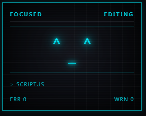
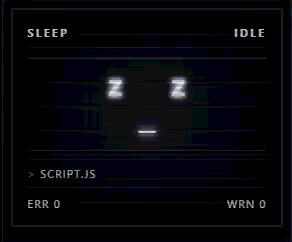

# Code Feelings

A tiny companion for VS Code that reacts to your coding activity.

**Code. Errors. Warnings. Saves. Inactivity.**

Your code has consequences.
The machine notices.

## Features

Code Feelings monitors your current coding state and changes its expression accordingly.

* **Neutral** — `X X`
* **Focused** — `^ ^`
* **Warning** — `O o`
* **Error** — `@ @`
* **Save Error** — `\ /`
* **Save Success** — `O O`
* **Idle** — `= =`

The companion reacts to:

* Typing activity
* Active files
* Errors
* Warnings
* Successful saves
* Saves containing errors
* Inactivity

The face uses a CRT/terminal-inspired visual style with small state-based reactions.

## How It Works

Code Feelings observes activity inside VS Code and maintains a small internal state.

The extension keeps raw coding state separate from the derived mood, allowing the face to react without mixing presentation logic into the activity state.

## Requirements

No additional software or configuration is required.

Code Feelings runs inside Visual Studio Code.

## Usage

Install Code Feelings and open VS Code.

The companion appears in the Explorer sidebar automatically.

Start coding and Wrenchy will react to your activity.

You can disable the extension through VS Code's normal extension controls:

**Extensions → Code Feelings → ⚙️ → Disable**

## Known Issues

This is an early release.

If you encounter a bug, please report it through the project's issue tracker.

## Release Notes

### 0.0.1

Initial release.

* Added Wrenchy companion
* Added activity tracking
* Added typing detection
* Added active file detection
* Added diagnostic tracking for errors and warnings
* Added save state detection
* Added inactivity detection
* Added mood system
* Added CRT/terminal-inspired interface
* Added state-based facial expressions

---

## License

See the repository for license information.

---

Made with TypeScript, VS Code, and a slightly judgmental machine spirit.
